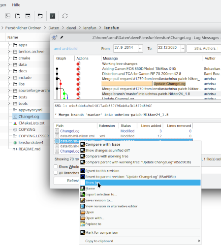
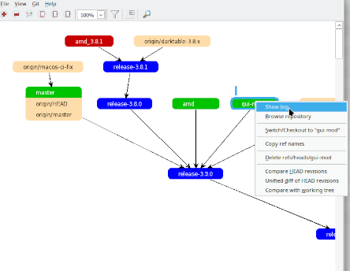

# TortoiseGit with Linux/Dolphin

## What it is

TortoiseGit is a GUI-Tool for Git, which runs on Microsoft Windows. It differs from all other such tools by the kind of operation. It extensively uses context menus, which makes it very intuitive.

On Windows it is integrated into Windows Explorer. All operations start there from context menus of files or directories. It also overlays the file icons with little symbols, which show the git status of the file or directory.

As said, it is very intuitive and a fun to use.

On Linux, the main Tortoise Git applications can be run under wine. But since this is not a complete application and relies on the integration into Windows Explorer, it needs some additional tooling. The overlay icons already exist in the KDE dolphin file browser (must be enabled: git context menu item).

This project contains the configuration files for the context menu items in dolphin, a script for calling the Windows git program and this How-To.

## 

## Why

Since this comes with a set of problems, you may not want to use it for production purposes. So then, why have it at all?

It can serve as a case study, easily accessible to Linux users and developers, about what can be done with this type of handling. Experiencing it is very different from just talking about it. So my hope is to get something similar for Linux in the long run.

But in case you know and love TortoiseGit from Windows and are frustrated about not having something like this under Linux, you may actually use it with care. But see the section about the problems below.

## Installation

For the Linux side you need the dolphin file manager and wine. I didn't test versions. As of end 2024 I have current versions of these, but earlier versions should be fine too.

You probably want to install into a special wine prefix. E.g.:

> export WINEPREFIX=/home/me/wine/wine-git[^1]
>
> winecfg

TortoiseGit needs a git installation. I am not aware of a working method to start Linux git from within a wine application. Therefore you have to install [git for Windows](https://gitforwindows.org/):

> wine Git-2.47.1-64-bit.exe[^2][^3][^4]

For TortoiseGitMerge you need a library for ribbons:

> winetricks uiribbon

At last install [TortoiseGit](https://tortoisegit.org/):

> wine TortoiseGit-2.17.0.2-64bit.msi

For the Linux side:

Copy or link the 2 .desktop files into ~/.local/share/kio/servicemenus/

**winegit**: Included here is a small  bash-script to run *Git for Windows*. Copy  `winegit` into your path (e.g. /usr/local/bin, $HOME/.local/bin, $HOME/bin) and make it executable.

This would usually run under Windows in another type of terminal. It outputs control characters for coloring the output, which are not understood by Linux terminals. Therefore:

>  winegit config --system --add color.ui false

The output from winegit is also intermingled with lots of error and warning messages from wine. Therefore the script pipes stderr to /dev/null.

**Environment**:If you installed everything into a separate prefix, you have to set an environment variable TORTOISE_PREFIX with your prefix path in such a way, that dolphin has this environment variable. E.g. (don't forget to correct the path)[^5]:

> mkdir -p $HOME/.config/environment.d
>
> echo "TORTOISE_PREFIX=$HOME/wine/wine-git" > $HOME/.config/environment.d/tortoise_prefix.conf

or 

> echo "export TORTOISE_PREFIX=$HOME/wine/wine-git" > $HOME/.config/plasma-workspace/env/tortoise_prefix.sh

The first form is not KDE specific, but only works, if KDE is started with systemd. The second form is a little bit obscure, but works everywhere.

You have to re-login for this to take effect. After re-login open dolphin, press F4 for getting the dolphin console and type

> env|grep TORTOISE_PREFIX

The variable should show up. Then you can try

> winegit -v

To check out the git configuration and compare the wine vs. linux version, go into a repo and

> winegit config --list --show-origin
>
> git config --list --show-origin

## Help

From the context menu, you can start a help viewer with a quite extensive manual. You can also see this [online](https://tortoisegit.org/docs/tortoisegit/index.html).

To better understand the desktop files, please see the section Automating TortoiseGit->TortoiseGit Commands.

## Problems and Configuration

### Line Endings

The most obvious problem is the different line endings in Linux (LF) and Windows (CR-LF). Git can automatically help with this. During Checkout LFs are replaced by CR-LFs and during checkin they are replaced back. Unfortunately this only works well, if Git knows, which files are text and which are not. And this may break. But as long as you don't use Windows Editors or IDEs, there is absolutely no need to do this. TortoiseGit doesn't care about line endings. Therefore this feature should just not be activated at all:

> winegit config --system --add core.autocrlf false

If it is activated on project level, TortoiseGit will not make things worse. If you want to remove that, go to your project folder and:

> winegit config --unset core.autocrlf

### Filemode

Next problem is filemode. Under Linux every file has a mode, which holds, who may do what and if the file is executable. Windows doesn't have this concept and so this information is not available to *Git for Windows*. But Git may track this. This can e.g. show up, if you check the status of a freshly (on the Linux side) committed repo. TortoiseGit will show you some modified files, but no text in these files has changed. What has changed is the executable bits. Under Linux the files may be executable and Git has recorded that, but for *Git for Windows* no files are ever executable. So it detects a modification. If you commit that change and later check the file out again, the executable property is lost.

To solve this, turn filemode tracking off for TortoiseGit:

> winegit config --system --add core.filemode false

You may turn it on explicitly on the Linux side, but on is the default anyway:

> git config --global --add core.filemode true

Unfortunately Git automatically turns filemode tracking explicitly on in a repo config, when you init a new repo or clone a repo on Linux. And the local config has higher priority than the system config. If you init or clone a new repo with winegit, it explicitely disables filemode for this repo, which is wrong for the Linux side.

This could be overwritten by passing this filemode=false via the environment to *Git for Windows*. Unfortunately TortoiseGit seems to remove all git related environment variables.

So you have to manually remove that for every repo (do this in the repo directory):

> git config --unset core.filemode

The underlying root cause for this is, that linux git and wine git share the same repo directory / repo clone and therefore they share the same local repo config. This otherwise never happens in mixed Linux / Windows projects.

### Symlinks

*Git for Windows* through wine does not see symlinks as symlinks, but as normal files. The Linux side breaks, if you check them in through TortoiseGit.

Git can handle symlinks  in a special way on filesystems which don't know them, if you set core.symlinks=false. They are then checked out as normal small files, which contain the destination path. During checkin, they are again saved as symlinks. This way, they stay intact in the repo, but in the filesystem they don't work anymore. `git init` and `git clone` set core.symlinks=false in the local repo config, when you run them through winegit. So even on the Linux side they would be handled this way.

In summary, symlinks don't work with TortoiseGit. If you need them, better use other tools, or find a way through the mess and be carefull.

### Other Problems

Other fields of problems may be path conversion and speed. Also there are some visual glitches.

------

[^1]: Adjust the path according to your preferences. With the export and given on a line by itself, it is valid for all further commands in this shell. That is assumed in this description. If you use the default PREFIX (i.e your virtual Windows directory is $HOME/.wine), then this command is not needed
[^2]: The default architecture size for wine nowadays is 64 Bit. If you prefer a 32 bit system, create your prefix with: `WINEARCH=win32 winecfg` and install `Git-2.47.1-32-bit.exe`

[^3]: Choose Checkout as-is, commit as-is; For symbolic links, see the section about symlinks.

[^4]: As of wine 9.20, the installer hangs at the very end. No problems observed.

[^5]: If you installed into the default prefix ~/.wine, then this is not necessary. As an alternative, you can also modify the files and put your prefix directly into it. In case of an update, this would have to be repeated.

